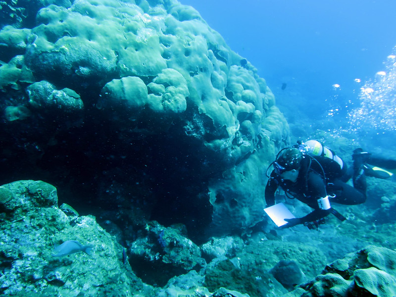

```{r, include=FALSE}
knitr::opts_chunk$set(
  results='asis', 
  echo = FALSE
)
if (!require("pacman")) install.packages("pacman")
pacman::p_load("scholar", "icon", "magrittr", "googlesheets4")
cites = scholar::get_profile("BNRzfKIAAAAJ&hl")
source("cv_printing_functions.R")
# Read in all data and initialize a CV printer object
CV <- create_CV_object(
  data_location = "https://docs.google.com/spreadsheets/d/1GTwWN0uoPiIhaAC6YFklg2uAkx6hHxW7G005OWUCliY/",  
  pdf_mode = params$pdf_mode
)
```


Aside
================================================================================

{width=100%}

Research technician <br>specializing in coral health and disease, coral reef <br>ecology, and 3D photogrammetry.

Contact Info {#contact}
--------------------------------------------------------------------------------

- <i class="fa fa-map"></i> 24244 Overseas Highway, Summerland Key, FL 33042
- <i class="fa fa-phone"></i> +1 (301) 704-9605
- <i class="fa fa-envelope"></i> combsi9892@gmail.com
- <i class="fa fa-google"></i> [Ian Combs](https://scholar.google.com/citations?user=BNRzfKIAAAAJ&){target="_blank"}  
- <i class="fa fa-github"></i> [icombs2017](https://github.com/icombs2017){target="_blank"}  
- <i class="fa fa-twitter"></i>[Scleractinian_](https://twitter.com/Scleractinian_){target="_blank"}


Skills {#skills}
--------------------------------------------------------------------------------

- Coral reef ecology
- Large Area Imagery
- Coral health and disease
- 160+ Scientific Dives
- Multivariate data analysis
- Structure-from-Motion Photogrammetry


Main
================================================================================


Ian R. **Combs** {#title}
--------------------------------------------------------------------------------

### Coral reef ecology, coral health and disease 

Education {data-icon=graduation-cap}
--------------------------------------------------------------------------------

### M.Sc. in Biological Sciences
Florida Atlantic University

Boca Raton, FL

2019 - 2017

Thesis: Characterizing the impacts of stony coral tissue loss disease on coral in southeast Florida using 3D photogrammetry<br>
Advisor: Dr. Joshua Voss

### B.Sc. in Marine Science
University of Delaware

Newark, DE

2014 - 2010


Research Experience {data-icon=flask}
--------------------------------------------------------------------------------

### Coral Reef Ecosystems Biologist

Mote Marine Laboratory

Summerland Key, FL

Present - 2020

Dr. Erinn Muller, Erich Bartels

Established Mote Marine Laboratory's photogrammetry program, created and optimized rigorous methods for obtaining broad-scale ecological information to better inform monitoring and restoration practices. Incorporated Structure-from-Motion photogrammetry across all scales of restoration from large-area imaging on the macro-scale (500m<sup>2</sup>) and single colony fate-tracking on the the micro-scale (100cm<sup>2</sup>).

### Research Technician

FAU, Harbor Branch Oceanographic Institute

Ft. Pierce, FL

2020 - 2019

Voss Laboratory

Dr. Joshua Voss

Lead field research operations for local southeast Florida stony coral tissue loss disease related projects including disease monitoring, fate-tracking, disease <br>intervention, and tissue sampling. Responsible for sample processing, data <br>entry, data analysis, and database management of southeast Florida projects. Maintain lab and field supplies, chemical inventory, and lab equipment. Mentor interns and assist students in the lab. Assist with report and publication writing.

### Graduate Research Assistant

FAU, Harbor Branch Oceanographic Institute

Ft. Pierce, FL

2019 - 2017

Voss Laboratory

Dr. Joshua Voss

Executed fieldwork for southeast Florida stony coral tissue loss disease projects, collected and analyzed roving diver disease survey data, adapted and optimized 3D photogrammetry technique to assess surface area of fate-tracked coral colonies, processed and analyzed 3D photogrammetry data, intervened on <br>diseased, fate-tracked coral colonies. Participated in 2 research cruises totalling 20+ days at sea. 

### Coral Restoration Intern

Mote Marine Laboratory

Summerland Key, FL

2017

Elizabeth Moore International Center for Coral Reef Research & Restoration

Chris Page

Maintained land-based coral nursery including water quality, raceway <br>maintinence, and microfragmentation 

### Coral Health and Disease Research Intern

Mote Marine Laboratory

Sarasota, FL

2016

Coral Health and Disease Laboratory

Dr. Erinn Muller

Collected, processed, and analyzed data to better understand genotypic <br>responses to ocean acidification and temperature in *Acropora cervicornis*

### Research Assistant 

University of Delaware

Lewes, DE

2014

Team Benthic Habitat Mapping

Dr. Douglas Miller

Processed over 1,000 benthic AUV photographs assessing incidental mortality of sea scallops from commercial fishing dredges 

Teaching Experience {data-icon=school}
--------------------------------------------------------------------------------

### Graduate Teaching Assistant

FAU Harbor Branch Oceanographic Institute

Ft. Pierce, FL

2018

Marine Biodiversity

Gathered specimens, set up experiments, assisted students in the field and in the laboratory, proctored exams, graded and provided feedback on end of <br> semester project

### Research-based After-school Program for Students

Mote Marine Laboratory

Summerland Key, FL

2017

Assisted high school students with designing, implementing, and analyzing their own research projects

### Alumni Service Corps

Gonzaga College High School

Washington, D.C.

2015 - 2014

Substitute taught a wide variety of classes, coached rugby and water polo, <br>coordinated volunteering, meal preparation, and meal delivery at Gonzaga's chapter of Campus Kitchen


Students and Interns Mentored <br> and Co-supervised {data-icon=chalkboard-teacher}
--------------------------------------------------------------------------------

### Kamryn Herbison
**Mote REU Intern**

N/A

2022

### Brooke Pohlman
**Mote College Intern**

N/A

2022

### Ryan Rogers
**Mote REU Intern**

N/A

2021

### Brielle D'Alonzo
**Mote College Intern**

N/A

2021

### Brianna Matthews
**Mote College Intern**

N/A

2021

### Ashley Carreiro
**Coral Reef Health and Ecology Lab**<br>
Determining stony coral tissue loss disease intervention success <br>on *Montastraea cavernosa* using 3D photogrammetry

N/A

2020 

### Mckenna Rayburn
**Link fellowship intern**<br>
Intervention methods and rate of tissue loss on stony coral tissue loss <br>disease-affected *Montastraea cavernosa* in the Florida Reef Tract

N/A

2019

### Diana Perez 
**Link fellowship intern**<br>
Zooxanthellae characterization and connectivity in *Montastraea cavernosa*

N/A

2018

Refereed Publications {data-icon=pencil-alt}
--------------------------------------------------------------------------------

### Characterizing the impacts of stony coral tissue loss disease on corals in southeast Florida using 3D photogrammetry

*PLoS* 2021.

N/A

N/A

**Combs IR**, Studivan MS, Eckert, RJ, Voss JD

### Assessing the effectiveness of two intervention methods for stony coral tissue loss disease on *Montastraea cavernosa*

*Scientific Reports* 2021.

N/A

N/A

Shilling EN, **Combs IR**, Voss JD


Technical Reports {data-icon=newspaper}
--------------------------------------------------------------------------------

### Intervention and fate tracking for corals affected by stony coral tissue loss disease in the northern Florida Reef Tract

Florida Department of Environmental Protection

N/A

2019

Voss JD, Shilling E, **Combs I**


Presentations {data-icon=comment-alt}
--------------------------------------------------------------------------------

### Characterizing impacts of scleractinian tissue loss disease on corals in southeast Florida with photogrammetry and 3D modeling
48th Annual Benthic Ecology Meeting

St. John’s, NL, Canada

2019

**Combs IR**, Beal J, Voss JD<br>
**Oral presentation**
 
### Characterizing the impacts of scleractinian tissue loss disease on corals in southeast Florida

ASLO Aquatic Sciences Meeting

San Juan, PR

2019

**Combs IR**, Beal J, Voss JD<br>
**Poster presentation** 

### Impacts of scleractinian tissue loss disease on corals in <br> southeast Florida

Indian River Lagoon Symposium<br>Outstanding Presentation Award

Ft. Pierce, FL

2019

**Combs IR**, Beal J,  Voss JD<br>
**Poster presentation**

### Understanding coral disease through 3D Modeling 

HBOI Ocean Discovery Visitors Center <br> Marine Science Fridays

Ft. Pierce, FL

2019

**Combs IR**<br>
**Oral presentation**

### Eulogy for the St. Lucie Reef

3MT - Three Minute Thesis Competition<br>Heat 7 Runner-Up<br>4th Place Overall

Ft. Pierce, FL

2018

**Combs IR**
**Oral presentation**

### White blotch disease impacts on corals in southeast Florida 

47th Annual Benthic Ecology Meeting

Corpus Christi, TX

2018

**Combs IR**, Beal J, Voss JD<br>
**Poster presentation**


Funding {data-icon=money-bill}
--------------------------------------------------------------------------------

### Indian River Lagoon Graduate Research Fellowship

$7,947

N/A

2019 - 2018

### FAU GPSA Travel Awards

$1,600

N/A

2019 - 2018

Certifications {data-icon=id-card}
--------------------------------------------------------------------------------

### AAUS Scientific Diver

100’

N/A

N/A

### PADI Enriched Air Nitrox Certification

N/A

N/A

N/A

### DAN Oxygen delivery, First Aid, and CPR for scuba diving injuries

N/A

N/A

N/A

### USFWS Motorboat Operator Certification Course

N/A

N/A

N/A


Membership and Service {data-icon=id-card-alt}
--------------------------------------------------------------------------------

### Association for the Studies of Limnology and Oceanography

N/A

N/A

2018

### Benthic Ecology Meeting Society

N/A

N/A

2018

Skills {data-icon=toolbox}
--------------------------------------------------------------------------------

### Field research planning, logistics, and execution
N/A

N/A

N/A

### Coral sampling, benthic surveys, photography, navigation and mapping
N/A

N/A

N/A

### 3D photogrammetry, 3D model generation using Agisoft Metashape, 3D model analysis using Rhinoceros 3D
N/A

N/A

N/A

### Data visualization using R statistical software and R Markdown
N/A

N/A

N/A

### Multivariate statistical analyses
N/A

N/A

N/A

### Python
N/A

N/A

N/A

### Data management using GitHub
N/A

N/A

N/A

### Scientific SCUBA diving
N/A

N/A

N/A


References {data-icon=user-friends}
--------------------------------------------------------------------------------

### Dr. Erinn Muller

Associate Vice President for Research<br> Program Manager for Coral Health & Disease, Coral Restoration<br> Senior Scientist<br> Supervisor


Mote Marine Laboratory

N/A

<i class="fa fa-phone"></i> +1 (941) 388–4441 ext310<br>
<i class="fa fa-envelope"></i> emuller@mote.org


### Erich Bartels

Staff Scientist<br> Program Manager Coral Reef Monitoring & Assessment<br> Supervisor


Mote Marine Laboratory

N/A

<i class="fa fa-phone"></i> +1 (305) 395-8729<br>
<i class="fa fa-envelope"></i> ebartels@mote.org


### Dr. Joshua Voss

Associate Research Professor<br> CIOERT Executive Director<br> M.Sc. Advisor


Florida Atlantic University

N/A

<i class="fa fa-phone"></i> +1 (772) 242–2538<br>
<i class="fa fa-envelope"></i> jvoss2@fau.edu


Disclaimer {#disclaimer style="width: var(--sidebar-width); padding-left: var(--sidebar-horizontal-padding)"}
--------------------------------------------------------------------------------

This curriculum vitae was made with the R package [**pagedown**](https://github.com/rstudio/pagedown).

Last updated on `r Sys.Date()`.